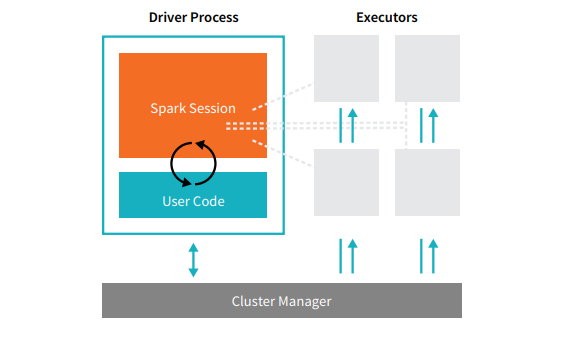

Поговорим про начальные параметры для создания Spark-session.

<!--more-->

# Введение
В работе часто сталкиваюсь когда новички в работе со Spark, не понимают как устроен его конфиг, что за что отвечает и в конце концов сколько ресурсов кластера будет потреблять та или инная сессия - давайте разбираться. Тк мы работает с большими данными, то и разбирать будем на примере Cluster - mod работы Spark-приложения.




# Драйвер
`Driver` - мастер процесс, который обеспечивает взаимодействие и распределение нагрузки от пользователя, до исполнителя(Executor). Драйвер создает задачи(task) для исполнителя. Также важно понимать, что драйвер создается с момента создания Spark-session и живет до ее окончания.

## Параметры конфигурации драйвера
`spark.driver.memory` - Память драйвера отвечает за управлением задачами и сбор результатов.
`spark.driver.memoryOverhead` - это "расширяемая" память которая отвечает за накладные расходы. Обычно данный параметр по умолчанию равен 6 - 10% от driver.memory, но минимум 384мб.

У драйвера на самом деле гораздо больше возможных конфигураций, но основа которая используется в работе это память. Размер spark.driver.memory обычно из-за специфики своей работы не требует больших объемов если вы не переводите DataFrame в RDD или Collect. Поэтому я бы условился, что объем памяти драйвера в 2 раза меньше памяти исполнителя, но минимум 1 гб.

# Исполнитель
`Executor` - исполнитель выполняет все рабочие задачи (расчеты), в случае отказа одного из исполнителей другие стораются перехватить его задачу если это возможно, также исполнитель возвращает результат работы драйверу. Чем больше исполнителей, тем больше может выполняться параллельных задач если это допускает код. Но слишком много исполнителей предполагает потребление больших ресурсов.

## Параметры конфигурации исполнителя

### Динамическая аллокация
`spark.dynamicAllocation.enabled` - изначально параметр со значением **false**.
Данный параметр отвечает за динамическую аллокацию ресурсов сервера. То есть если вы задали некие параметры по динамическим ресурсам, то в зависимости от необходимости Spark сам будет понимать сколько ему надо задействовать ресурсов исходя из максимума и минимума который был задан. Но не все так гладко, если в конфигурации поставить слишком много ресурсов, то в какой-то момент Spark их все будет утилизировать, просто потому что может не очищать trash и тд. С другой стороны если у вас есть кластер, на котором работает много людей и переодически ваша очередь полностью утилизируется, то динамическая аллокация может дать плохой результат.

Например под определенный расчет Spark понизит число потребляемых ресурсов, а следующий за ним потребует гораздо большего числа этих самых ресурсов, но эти ресурсы утилизирует кто-то другой, тогда скорее всего ваш запрос просто упадет их-за нехватки ресурсов.
Резюмируя, динамическая аллокация больше подходит под "простые" расчеты или ad-hoc, тк позволяют не отнимать лишние ресурсы и по окончанию работы запросов приводит конфигурацию к минимально заданной конфигурации.


`spark.dynamicAllocation.executorIdleTimeout `- по умолчанию равен 60 секунд. Параметр отвечающий через сколько будет удален исполнитель при его простое более чем указанное время.

`spark.dynamicAllocation.initialExecutors` - количество испольнителей с которыми будет инициализироваться динамическая аллокация.

`spark.dynamicAllocation.maxExecutors` - максимальное количество исполнителей которое может быть использовано в Spark-session.

`spark.dynamicAllocation.minExecutors` - минимальное количество исполнителей которое может быть использовано в Spark-session.

`spark.executor.memory` - количество памяти на исполнитель.

`spark.executor.cores` - каждый исполнитель как и драйвер (но драйверу хватает 1 ядра которое стоит по умолчанию) обладает помимо параметров памяти еще и ядрами. Чем больше ядер - тем выше параллельность расчета задачи. Но тут важно учитывать, что ядра и память по сути связаны и добавляя большое количество ядер, за счет высокой паралелльности может закончится память. В таких случаях имеет смысл убавить количество ядер и добавить исполнитель.

`spark.executor.memoryOverhead`- это "расширяемая" память которая отвечает за накладные расходы. Обычно данный параметр по умолчанию равен 6 - 10% от executor.memory, но минимум 384мб.


**Итого** получаем следующий набор параметров для конфигурации **динамичной** аллокации:

```python
spark.driver.memory = 5g
spark.dynamicAllocation.enabled = true
spark.dynamicAllocation.initialExecutors = 1
spark.dynamicAllocation.minExecutors = 1
spark.dynamicAllocation.maxExecutors = 3
spark.executor.memory = 10g
spark.executor.cores = 3
spark.executor.memoryOverhead = 1g
spark.driver.memoryOverhead = 1g
```


### Статичная аллокация
`spark.dynamicAllocation.enabled` - значение из прошлого пункта в данном случае обязательно должно быть **false**.

`spark.executor.instances` - сколько будет использовано исполнителей в Spark-session.

`spark.executor.memory` - параметр работает также как и в динамической аллокации.

`spark.executor.cores` - параметр работает также как и в динамической аллокации.

`spark.executor.memoryOverhead` - параметр работает также как и в динамической аллокации.

Как уже затронул тему в динамической аллокации, статичная аллокация - полезна больше для промышленных расчетов, когда более важна стабильность. В идеале подобные расчеты не должны запускать вручную тк по окончании должна убиваться Spark-session, чтобы высвободить аллоцированные ресурсы, что часто забывается.


**Итого** получаем следующий набор параметров для конфигурации **статичной** аллокации:

```python
spark.driver.memory = 5g
spark.executor.instances = 3
spark.executor.memory = 10g
spark.executor.cores = 3
spark.executor.memoryOverhead = 1g
spark.driver.memoryOverhead = 1g
```


# Работа с партициями
Тема работы с партициями очень объемная и требует отдельного поста но не затронуть сейчас ее нельзя тк партиции требуют дополнительных настроек в конфигурации. В данном случае я лишь рассмотрю основные прицнипы.
```python
spark.hadoop.hive.exec.dynamic.partition=true
spark.hadoop.hive.exec.dynamic.partition.mode=nonstrict
```

Тут на самом деле сложно что-то добавить. Эти 2 команды позволяют в случае `insert into` в таблицу с `mod=overwrite` не перезаписать всю таблицу целиком, а переписать только те партиции которые уже существуют и находятся в `DataFrame` который вы хотите записывать. Если же таких партиций нет, то просто будут созданы новые партиции. В случае если в таблице партиций нет, то эти настройки никак не повлияют и таблица будет полностью перезаписана полностью.

Но раз ужу заговорили про партиции, то лишь добавлю, что хороший практикой будет делать repartition при сохранении/инсерте таблицы.
Пример:
```python
df.repartition(1).write.partitionBy('column_name').mode('overwrite').saveAsTable('table_name')
```

То есть тут мы получим таблицу `table_name` с партициями по `column_name`, где внутри партиции будет сохранен 1 parquet файл. Если размер parquet файла превышает объем 256мб и при этом может быть поделен до размера до 256мб, то лучше так и сделать. То есть например мы получили файл 512мб, то просто указываем `repartition(2)`. Иначе может возникать перекос в данных и все сопутствующие с этим проблемы. Но "мельчить" файлы тоже не стоит, тк Hadoop хранит каждый файл в метасторе и тем самым забивает его от чего страдает производительность.

# Итог

Давайте подводить итоги, мы разобрались с базовыми настройками конфигурации в Spark. Поняли когда лучше динамическая или статичная аллокация ресурсов, а также научились не перезаписывать таблицу полностью при попытке добавления новых партиций. Но как понять сколько нужно памяти или ядер под ту или инную задачу?
На самом деле однозначного ответа - нет. Все конфигурации подбираются исходя из конфигураций вашего кластера, его загруженности, объема задачи которую вы хотите совершить и тд.
Но давайте с учетом уже имеющейся конфигурации рассчитаем сколько мы будет отнимать ресурсов у кластера:

**Количество ядер** = `spark.driver.cores (по умолчанию = 1) + (spark.executor.instances * spark.executor.cores)`

**Количество памяти:**
```
((spark.executor.instances * spark.executor.memory) +
(spark.executor.instances(или spark.dynamicAllocation.maxExecutors) * spark.executor.cores))
+ (spark.driver.memory + spark.driver.memoryOverhead)
```

Если рассматривать конфигурацию из нашего примера:
```python
spark.driver.memory = 5g
spark.dynamicAllocation.enabled = true
spark.dynamicAllocation.initialExecutors = 1
spark.dynamicAllocation.minExecutors = 1
spark.dynamicAllocation.maxExecutors = 3
spark.executor.memory = 10g
spark.executor.cores = 3
spark.executor.memoryOverhead = 1g
spark.driver.memoryOverhead = 1g
```

Считаем максимальные ресурсы которые будет потреблять наша Spark-session:

```python
#Ядер
10 = 1+(3*3)
# Память
39 = ((3 * 10) + (3 * 1))+ (5 + 1)
```
