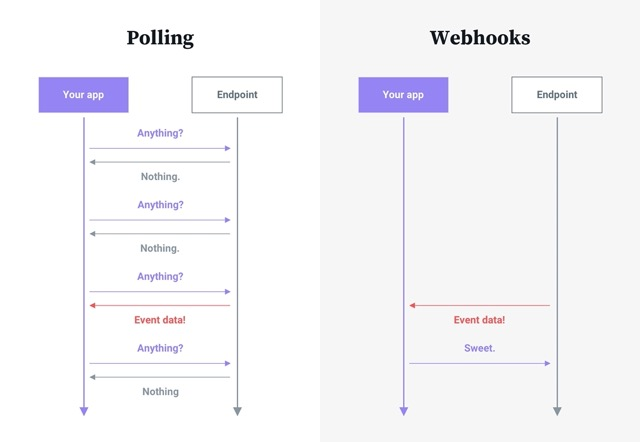
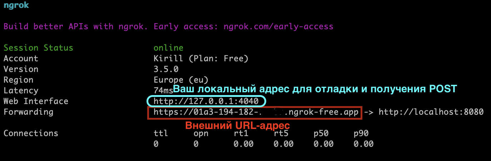
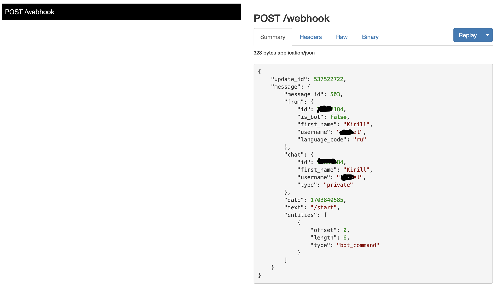

Разберем Webhook на Aiogram 3

<!--more-->

# Webhook
Давайте для начала разберем что это и для чего. `Webhook` - это способ отслеживания изменений на стороне Сервера-информатора через протокол HTTP. То есть сервер на котором произошли изменения отправляет на наш HTTP эти самые изменения, которые мы в последствии можем обрабатывать. Из этого вытекает главный плюс такого подхода в сравнении с `Polling`, вместо того что бы с какой то переодичностью отправлять запросы на сервер заправшивая у него информацию о возможных изменениях, мы просто слушаем и получаем эти самые изменения от сервера-источника.



Такой подход позволяет:
* Оперативнее обрабатывать данные.
* Дает меньшую нагрузку на наш сервер.


Минусы данного подхода:
* Сложнее настраивать.
* Необходим url-домен.
* Установка SSL.


**ВАЖНО**: Webhook требует шифрования SSL. Это необходимо для обеспечения безопасного соединения между серверами.
Не все SSL-подписи поддерживаются. Я использовал **Let's Encrypt.** через `acme`


## Отладка
### Ngrok
В первую очередь, для отладки работы рекомендую [Ngrok](https://ngrok.com), довольно простой и в тоже время удобный сервис. Позволяющий переадресовывать запросы из интернета к сайту поднятому локально на компьютере. А также просматривать в UI запросы, которые были на него получены.
Как следует из руководства на сайте для установки и запуска на MacOs необходимо:
* Установить Ngrok
```bash
brew install ngrok/ngrok/ngrok
```
* Добавить ваш персональный токен
```bash
ngrok config add-authtoken YOUR_TOKEN
```
* Запуститься на любом свободном порту
```bash
ngrok http PORT
```

Замените:

`YOUR_TOKEN` - на ваш токен ngrok

`PORT` - на свободный порт


В результате запуска последнего скрипта вы увидете следующее:

Если увидели `Session Status - online`- значит все работает и можете перейти и проверить web-страницы.

### Aiogram и Aiohttp echo-Bot
#### Настройка
Здесь мы используем связку **Aiogram** и **Aiohttp**, которые отлично взамодействуют.

Опять же воспользуемся примерами использования Телеграм-Бота на Webhook с официального сайта [Aiogram](https://docs.aiogram.dev/en/dev-3.x/dispatcher/webhook.html).
И немного его изменим:
```python
import logging
import sys
import ssl
from aiohttp import web
import asyncio
from aiogram import Bot, Dispatcher, Router, types
from aiogram.filters import CommandStart
from aiogram.types import Message
from aiogram.utils.markdown import hbold
from aiogram.webhook.aiohttp_server import SimpleRequestHandler, setup_application

# Bot token can be obtained via https://t.me/BotFather
TOKEN = "679280000:AAHXu3dhjadhasdakbdad2DRxgjZWZcykAR"

# Webserver settings
# bind localhost only to prevent any external access
WEB_SERVER_HOST = "0.0.0.0"
# Port for incoming request from reverse proxy. Should be any available port
WEB_SERVER_PORT = 8443

# Path to webhook route, on which Telegram will send requests
WEBHOOK_PATH = "/webhook"
# Secret key to validate requests from Telegram (optional)

# Base URL for webhook will be used to generate webhook URL for Telegram,
# in this example it is used public DNS with HTTPS support
WEBHOOK_URL = "https://88ef-194-182-00-01.ngrok-free.app"

# WEBHOOK_SSL_PRIV = "/home/user/cert/key.pem"
# WEBHOOK_SSL_CERT = "/home/user/cert/fullchain.pem"


# All handlers should be attached to the Router (or Dispatcher)
router = Router()

@router.message(CommandStart())
async def command_start_handler(message: Message) -> None:
    logging.debug(f"Received command_start: {message}")
    """
    This handler receives messages with `/start` command
    """
    # Most event objects have aliases for API methods that can be called in events' context
    # For example if you want to answer to incoming message you can use `message.answer(...)` alias
    # and the target chat will be passed to :ref:`aiogram.methods.send_message.SendMessage`
    # method automatically or call API method directly via
    # Bot instance: `bot.send_message(chat_id=message.chat.id, ...)`
    await message.answer(f"Hello, {hbold(message.from_user.full_name)}!")


@router.message()
async def echo_handler(message: types.Message) -> None:
    logging.debug(f"Received message: {message}")
    """
    Handler will forward receive a message back to the sender

    By default, message handler will handle all message types (like text, photo, sticker etc.)
    """
    try:
        # Send a copy of the received message
        await message.send_copy(chat_id=message.chat.id)
    except TypeError:
        # But not all the types is supported to be copied so need to handle it
        await message.answer("Nice try!")


async def on_startup(bot: Bot) -> None:
    # If you have a self-signed SSL certificate, then you will need to send a public
    # certificate to Telegram
    logging.info("Bot has been started")
    await bot.set_webhook(f"{WEBHOOK_URL}:{WEB_SERVER_PORT}{WEBHOOK_PATH}")
    logging.info("Webhook has been set up")

async def main() -> None:
    # Dispatcher is a root router
    bot = Bot(TOKEN)
    dp = Dispatcher()
    # ... and all other routers should be attached to Dispatcher
    dp.include_router(router)

    # Register startup hook to initialize webhook
    dp.startup.register(on_startup)

    # Initialize Bot instance with a default parse mode which will be passed to all API calls


    # Create aiohttp.web.Application instance
    app = web.Application()

    # Create an instance of request handler,
    # aiogram has few implementations for different cases of usage
    # In this example we use SimpleRequestHandler which is designed to handle simple cases
    webhook_requests_handler = SimpleRequestHandler(
        dispatcher=dp,
        bot=bot,
    )
    # Register webhook handler on application
    webhook_requests_handler.register(app, path=WEBHOOK_PATH)

    # context = ssl.SSLContext(ssl.PROTOCOL_TLSv1_2)
    # context.load_cert_chain(
    #     WEBHOOK_SSL_CERT, WEBHOOK_SSL_PRIV
    # )


    # Mount dispatcher startup and shutdown hooks to aiohttp application
    setup_application(app, dp, bot=bot)

    # And finally start webserver
    await web._run_app(app, host=WEB_SERVER_HOST, port=WEB_SERVER_PORT,
                        # ssl_context=context
                        )

if __name__ == "__main__":
    logging.basicConfig(level=logging.INFO, stream=sys.stdout)
    logging.getLogger('aiogram').setLevel(logging.DEBUG)
    asyncio.run(main())
```

**Переменные**:
* `TOKEN` - токен от Бота
* `WEB_SERVER_HOST` - `0.0.0.0.`, то есть будем слушать все IP адреса
* `WEBHOOK_PATH` - Путь по которому будут приходить `POST` уведомление от Телеграм и соответственно который мы будем слушать.
* `WEB_SERVER_PORT` - Телеграм позволяем производить общение только с `80, 88, 443, 8443` портом. Если у вас 443, то можно не указывать.


**Рассмотрим скрипт и дополним официальное описание:**
* `on_startup` - Данный метод меняет настройку Телеграм Бота и переключает его на webhook. Где сообщает, на каком URL с каким портом и по какому пути мы будем ожидать от телеграмма сообщения.
* `async def main() ` - сделали метод `main` асинхронным. Соответсвенно поменяли запуск этого метода на `asyncio.run(main())`
* `app = web.Application()` - создает приложение с пустой web-страницей для приема webhook
* `web._run_app` - тк мы сделали `main` асинхронным, то здесь указали `await` и поменяли `run_app` на `_run_app`


**Переменные при использовании своего домена:**
* `WEBHOOK_SSL_PRIV` - Если у вас имеется домен и вы получали SSL например через **Let's Encrypt.** Путь до приватного ключа.
* `WEBHOOK_SSL_CERT` - Если у вас имеется домен и вы получали SSL например через **Let's Encrypt.** Путь до публичного ключа.
* `context` - передаем подписанные сертификаты
* `ssl_context=context` - подписываем поднятую пустую web-страницу нашими сертификатами, для получения SSL/TLS

#### Запуск
Для запуска необходимо просто в любом IDE запустить скрипт выше, указав в нем свои переменные.
После запска можно отправить в вашего Бота сообщение и увидеть, какой webhook мы получили от Телеграм-сервера, перейдя на локальную страницу поднятую в ngrok.



На мой взгляд это отличный способ для отладки и понимания какие данные к нам придут в webhook.
Мы смогли запустить Эхо-Бота на Ngrok.

**Для просмотра статуса и настройки вашего webhook у Бота в Телеграм существует следующая ссылка:**

`https://api.telegram.org/bot<TOKEN_BOT>/getWebhookInfo` - Необходимо заменить `<TOKEN_BOT>`, на токен вашего Бота. По ссылке вы увидите информацию, о статусе включения webhook, по какому URL будет отправляться информация, из-за чего ошибка и тд.

## Дополнительная информация
### Обработка сторонних webhook
Предположим вы решили написать более серьезного Бота и вам необходимо обрабатывать сторонние webhook. Например для обработки оплаты или какие либо другие.

То тут ничего сложного, например сделаем простой метод, который будет показывать нам то, что пришло в сторонний webhook и отвечать статусом 200, что бы не было повторных отправлений этого webhook.
```python
from aiohttp.web_request import Request
from aiohttp import web

async def print_webhook(request: Request):
    req = await request.json()
    print(req)
    return web.Response(status=200)

```
А теперь там, где мы создавали `app`- web приложение, мы добавим следующую строчку:

```python
app = web.Application()
app.router.add_post("/your_webhook_path", print_webhook)
```

Так наше приложение начало слушать `https://your_domain.example/your_webhook_path` и если туда поступает информация, то срабатывает метод `print_webhook` в котором вы можете настроить абсолютно любую логику обработки.

Если у вас несколько разных источников, то просто добавляете новый путь, который будете слушать:
```python
app.router.add_post("/your_webhook_path2", print_webhook)
```

### Полезности
#### Передача дополнительных параметров в app
Если ваша логика обработки webhook предполагает например ответ пользователю или запись в БД.
То вы можете просто передать необходимые параметры в `app`, а затем их извлечь.
```python
from aiogram import Bot
from sqlalchemy.ext.asyncio import AsyncSession

app = web.Application()
app["bot"]: Bot = bot
app["session"]: AsyncSession = session

```


Теперь мы просто их извлекаем из web приложения:
```python
from aiogram import Bot
from sqlalchemy.ext.asyncio import AsyncSession

async def print_webhook(request: Request):
    session: AsyncSession = request.app["session"]
    bot: Bot = request.app["bot"]
    req = await request.json()
    await write_webhook(session, req)
    await bot.send_message(
        chat_id=tg_user_id, text=f"hello, webhook:\n\n {req}", reply_markup=your_keyboard
    )
    return web.Response(status=200)
```

В данном примере мы извлекли из `app` - Бота и сессию к БД. После чего с помощью метода `write_webhook` *(метод указан просто для примера, скрипт метода будет отличаться в зависимости от строения вашей БД и задачи)* записали полученный webhook в БД. После чего отправили сообщение на `tg_user_id` в котором также полностью передали всю полученную информацию.

#### Ссылки и команды
Оставлю **ссылки** которые использовались при подготовке данной статьи:
* https://t.me/S2Vel_bot - Пример моего бота на webhook с сервисом VPN.
* https://core.telegram.org/bots/webhooks#a-verified-supported-certificate - хорошее руководство по webhook от Телеграм
* https://docs.aiogram.dev/en/dev-3.x/dispatcher/webhook.html - руководство по webhook от Aiogram
* `https://api.telegram.org/bot<TOKEN_BOT>/getWebhookInfo `- как уже писал ранее, меняем `<TOKEN_BOT>` на токен вашего Бота и получаем статус подключения Бота к Webhook.

**Команды**:
* `curl -F "url=" https://api.telegram.org/bot<TOKEN_BOT>/setWebhook` - сброс настроек webHook. Меняем `<TOKEN_BOT>` на токен вашего Бота. Необходимо использовать если вы допустим использовали один домен на 2 разных ботах.

* `curl -F "url=https://<example_hook.example.com>:<PORT>/<webHook_Path>" https://api.telegram.org/bot<TOKEN_BOT>/setWebhook` - По сути эту команду мы отправляем в методе `on_startup`. Но хочу подсветить момент, если вы при разработке меняете Ботов, домены и тд. то бывают баги когда вроде бы все настроено, но почему то не работает. Мне помогла отправка данной команды после старта Бота, когда я получал ошибку `connection_refused`. В последствии при рестартах бота данного бага не наблюдалось. Но если менял Бота, то баг повторялся.

#### Безопасность
Для обеспечения безопасности работы вашего приложения, крайне рекомендуется ограничить IP адреса от которых принимается webhook.
Обычно сервисы которые отправляют информацию, указывают IP-адреса которые они используют.
* Для ограничения IP вы можете в скрипте проверять откуда вам поступил webhook

Пример:
```python
import ipaddress

ips = (
    "149.154.160.0/20",
    "91.108.4.0/22",
)

async def print_webhook(request: Request):
    client_ip = (
        request.headers.get("X-Real-IP")
        or request.headers.get("X-Forwarded-For")
        or request.remote
    )
    for subnet in ips:
        if "/" in subnet:
            if ipaddress.ip_address(client_ip) in ipaddress.ip_network(subnet):
                f = False
                break
        else:
            if client_ip == subnet:
                f = False
                break
    if f:
        return web.Response(status=403)

    session: AsyncSession = request.app["session"]
    bot: Bot = request.app["bot"]
    req = await request.json()
    await write_webhook(session, req)
    await bot.send_message(
        chat_id=tg_user_id, text=f"hello, webhook:\n\n {req}", reply_markup=your_keyboard
    )
    return web.Response(status=200)
```


* Ограничить через брендмауэр `ufw` доступ к порту на котором мы поднимали приложение `app`, например `8443` на уровне вашего **VPS**
 ```bash
sudo ufw allow from 149.154.160.0/20 to any port 8443
sudo ufw allow from 91.108.4.0/22 to any port 8443
 ```

Из этих двух вариантов, на мой взгляд предпочтительнее второй, тк вы открываете порт только для определенного набора IP. Плюс исключаете возможную подмену IP адреса из заголовка и если вдруг тот же Телеграм поменяет IP адреса, вам достаточно будет добавить новое правило в `ufw`, а не заного перевыкатывать скрипт.